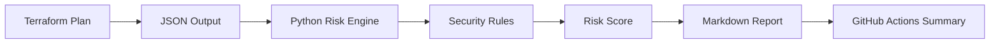

<div align="center">

# 🛡️ Terraform Change Guardian

### Automated Terraform plan risk analysis for secure infrastructure changes


<br/>

[](https://github.com/hemantsharma2189/terraform-change-guardian/actions/workflows/security-scan.yml)

</div>

---

## 📌 Project Overview

Terraform Change Guardian analyzes Terraform plan output before infrastructure changes are deployed.

The Python-based risk engine detects destructive operations, public network exposure, overly permissive IAM policies, disabled encryption and missing AWS resource tags. GitHub Actions automatically runs the analysis and publishes a Markdown risk report.

## 🔍 Security Checks

| Check | Severity | Description |
|---|---:|---|
| Resource deletion | Critical | Detects infrastructure scheduled for deletion |
| Resource replacement | High | Identifies delete-and-recreate operations |
| Public network access | High | Detects `0.0.0.0/0` and `::/0` exposure |
| Wildcard IAM permissions | High | Finds wildcard actions and resources |
| Disabled encryption | High | Detects resources with encryption disabled |
| Missing AWS tags | Low | Identifies untagged AWS resources |

## 🏗️ Architecture



## 📁 Project Structure

```text
terraform-change-guardian/
├── .github/
│   └── workflows/
│       └── security-scan.yml
├── examples/
│   └── insecure-plan.json
├── risk_analyzer.py
├── .gitignore
├── LICENSE
└── README.md
```

## ⚙️ How It Works

1. Terraform produces a plan in JSON format.
2. The Python analyzer reads `resource_changes`.
3. Security and operational rules inspect each planned change.
4. Findings receive severity levels and numerical risk scores.
5. A Markdown security report is generated.
6. GitHub Actions publishes the report as a workflow summary and artifact.

## ▶️ Run Locally

Clone the repository:

```bash
git clone https://github.com/hemantsharma2189/terraform-change-guardian.git
cd terraform-change-guardian
```

Run the included insecure test plan:

```bash
python risk_analyzer.py examples/insecure-plan.json
```

The generated report will be saved as:

```text
risk-report.md
```

## 🌍 Analyze a Real Terraform Plan

Create a binary Terraform plan:

```bash
terraform plan -out=tfplan
```

Convert it to JSON:

```bash
terraform show -json tfplan > plan.json
```

Run the analyzer:

```bash
python risk_analyzer.py plan.json --output risk-report.md
```

## 🧪 Included Security Test

The included `examples/insecure-plan.json` intentionally contains:

- Public SSH exposure
- Resource deletion
- Unencrypted storage
- Wildcard IAM permissions
- Missing resource tags

This test fixture demonstrates that the detection engine and CI workflow operate correctly.

## 📊 Example Findings

```text
CRITICAL: aws_s3_bucket.temporary_data
Resource deletion detected.

HIGH: aws_security_group.public_web
Resource allows traffic from the public internet.

HIGH: aws_ebs_volume.application_data
Encryption is disabled.

HIGH: aws_iam_policy.admin_policy
IAM configuration contains wildcard permissions.
```

## 🔄 CI/CD Automation

The GitHub Actions workflow automatically:

- Checks out the repository
- Configures Python
- Runs the risk-analysis engine
- Generates `risk-report.md`
- Adds results to the workflow summary
- Uploads the report as a downloadable artifact

## 🚀 Planned Enhancements

- Pull-request security comments
- Configurable policy thresholds
- SARIF output for GitHub Security
- Unit and integration tests
- Manual approval for high-risk changes


  ## 🤖 AI-Assisted Remediation

The optional AI module converts detected Terraform risks into evidence-based remediation guidance.

It provides:

- Technical risk explanations
- Potential business impact
- Recommended remediation steps
- Confidence levels
- Human-review warnings

Configure the AI API safely using environment variables:

```bash
export AI_API_KEY="your-api-key"
export AI_MODEL="your-model-name"
export AI_API_URL="your-compatible-api-endpoint"
```

Generate the standard risk report:

```bash
python risk_analyzer.py examples/insecure-plan.json
```

Generate AI-assisted remediation guidance:

```bash
python ai_explainer.py risk-report.md
```

The AI-generated output is saved as:

```text
ai-remediation.md
```

> API credentials must never be committed to the repository. All AI recommendations require human review before infrastructure changes are deployed.

## 👨‍💻 Author

**Hemant Sharma**

Cloud & DevOps Engineer focused on AWS, Terraform, Kubernetes, CI/CD automation and cloud security.

[LinkedIn](https://www.linkedin.com/in/hemantsharma20/) •
[GitHub](https://github.com/hemantsharma2189) •
[Portfolio](https://hemantsharma2189.github.io/Hemant-Sharma-Portfolio/)

---

<div align="center">

⭐ Star this repository if you find it useful.

</div>
